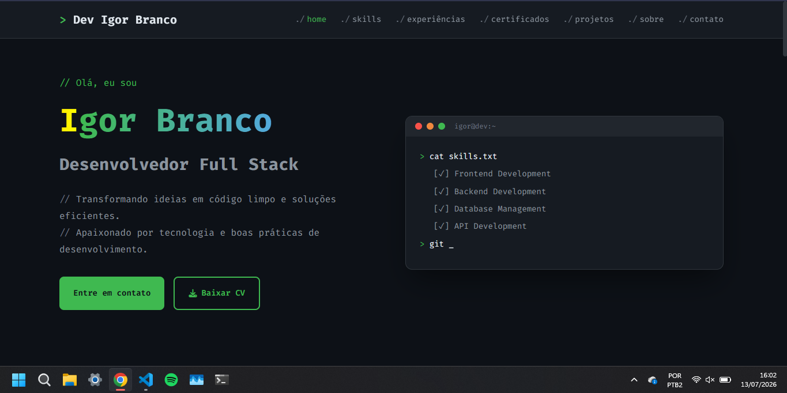

# Portfólio Igor Branco

**Site portfólio pessoal de desenvolvedor full stack, com estética de terminal, projetos reais e formulário de contato integrado.**

[](https://developer.mozilla.org/pt-BR/docs/Web/HTML)
[](https://developer.mozilla.org/pt-BR/docs/Web/CSS)
[](https://developer.mozilla.org/pt-BR/docs/Web/JavaScript)
[](https://www.netlify.com/)
[](https://opensource.org/licenses/MIT)

---

**[Site ao vivo](https://portifolioigordesouza.netlify.app/)** | **[Repositório](https://github.com/igordesouzabranco/portfolio-igor-branco)**

---

## Sobre o projeto

Portfólio profissional desenvolvido com HTML, CSS e JavaScript puro, sem frameworks ou build tools. O site funciona como vitrine para recrutadores e parceiros, apresentando skills técnicas, experiência profissional, certificados em andamento e projetos com link direto para o GitHub. A identidade visual segue o tema de um terminal de desenvolvedor.

## Funcionalidades

- **Navegação com scroll tracking** — menu fixo que destaca automaticamente a seção visível durante o scroll
- **Menu responsivo** — hamburger menu com animação em dispositivos móveis
- **Hero com terminal interativo** — efeito de digitação que simula comandos reais (node, npm, python, git)
- **Barra de skills com animação** — barras de progresso que se preenchem ao entrar no viewport
- **Timeline de experiências** — exibe trajetória profissional e formação acadêmica
- **Seção de certificados** — cursos em andamento com tags de tecnologias abordadas
- **Cards de projetos com modal** — ContJS, Origo API e DjangoCad com detalhes e link para o GitHub
- **Atividade recente no GitHub** — seção "No que estou trabalhando agora" que busca os últimos commits públicos via GitHub API e exibe em estilo terminal, com efeito de gradiente animado ao passar o mouse (igual ao hover dos cards de skills/projetos)
- **Pixel art com speech bubbles** — animação interativa no hover com comandos de terminal aleatórios
- **Formulário de contato** — integrado ao Netlify Forms, envio via fetch() com notificações visuais
- **Botão voltar ao topo** — aparece automaticamente após rolar a página
- **Toggle de animações** — botão no footer para desligar/ligar animações (persiste via localStorage)
- **Página 404 customizada** — erro com tema de terminal e link de volta para o início
- **Easter eggs** — bubble secreto ativado por atalhos de teclado (Shift x3, digitar "67") com fireworks
- **Acessibilidade** — aria-labels, suporte a prefers-reduced-motion, HTML semântico

## Tecnologias utilizadas

| Tecnologia | Uso no projeto |
|---|---|
| HTML5 | Estrutura semântica, meta tags Open Graph, forms com Netlify |
| CSS3 | Custom Properties, Flexbox, Grid, animações CSS, media queries |
| JavaScript vanilla | DOM manipulation, scroll handlers, fetch API, localStorage |
| Font Awesome | Ícones para nav, skills, projetos e contato |
| Google Fonts | Fira Code (única fonte, preloaded) |
| Netlify | Hospedagem, Netlify Forms, deploy automático via GitHub |
| GitHub REST API (pública) | Busca dos últimos commits para a seção "Agora", sem autenticação |

## Habilidades demonstradas

| Funcionalidade | Competência técnica |
|---|---|
| ContJS (Node.js/Express/MongoDB) | Autenticação, proteção CSRF, CRUD, multi-tenant, deploy no Render |
| Origo API (Java/Spring) | API REST, persistência em PostgreSQL, tratamento de erros, boas práticas de desenvolvimento |
| Sistema de cadastro Django (DjangoCad) | CRUD completo, autenticação, formação de banco de dados, Python/Django |
| Navegação com scroll tracking | Event listeners, requestAnimationFrame, detecção de viewport |
| Terminal com efeito de digitação | Manipulação de strings, setTimeout/setInterval, lógica de state |
| Formulário com Netlify Forms | Fetch API, FormData, tratamento de erros, integração com backend |
| Animações e transições CSS | Keyframes, CSS transitions, custom properties, performance com will-change |
| Toggle de animações com localStorage | Persistência de estado no cliente, manipulação de classes |
| Menu responsivo | Media queries, toggle de classes, acessibilidade (aria-expanded) |
| Modal de projetos | Criação dinâmica de conteúdo, event delegation, teclado (ESC) |
| Easter eggs e interações | Eventos de teclado, geração aleatória de conteúdo, animações programáticas |
| Seção "No que estou trabalhando agora" | Consumo de API REST pública, fetch assíncrono, cache em sessionStorage, tratamento de erros de rede |

## Screenshot



## Como rodar localmente

```bash
# Clone o repositório
git clone https://github.com/igordesouzabranco/portfolio-igor-branco.git

# Entre na pasta do projeto
cd portfolio-igor-branco/portifolio

# Abra o index.html no navegador
# No Windows:
start index.html

# No macOS:
open index.html

# No Linux:
xdg-open index.html
```

Não é necessário instalar dependências, rodar build commands ou configurar nada. O projeto funciona com HTML, CSS e JavaScript puros.

## Contato

- **Email:** igordesouzabranco@gmail.com
- **GitHub:** [igordesouzabranco](https://github.com/igordesouzabranco)
- **LinkedIn:** [Igor de Souza Branco](https://linkedin.com/in/igor-de-souza-branco-b68630314)

## Licença

Este projeto está licenciado sob a [MIT License](LICENSE).
